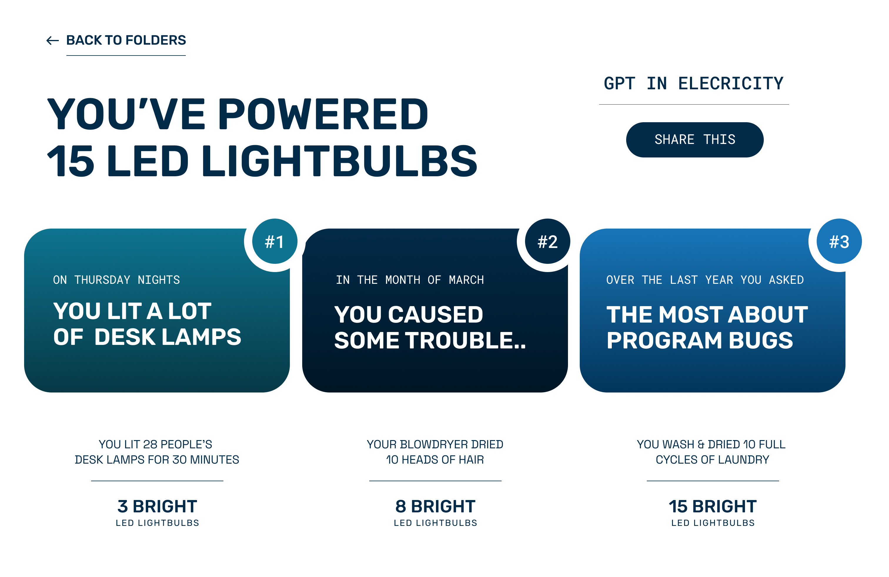
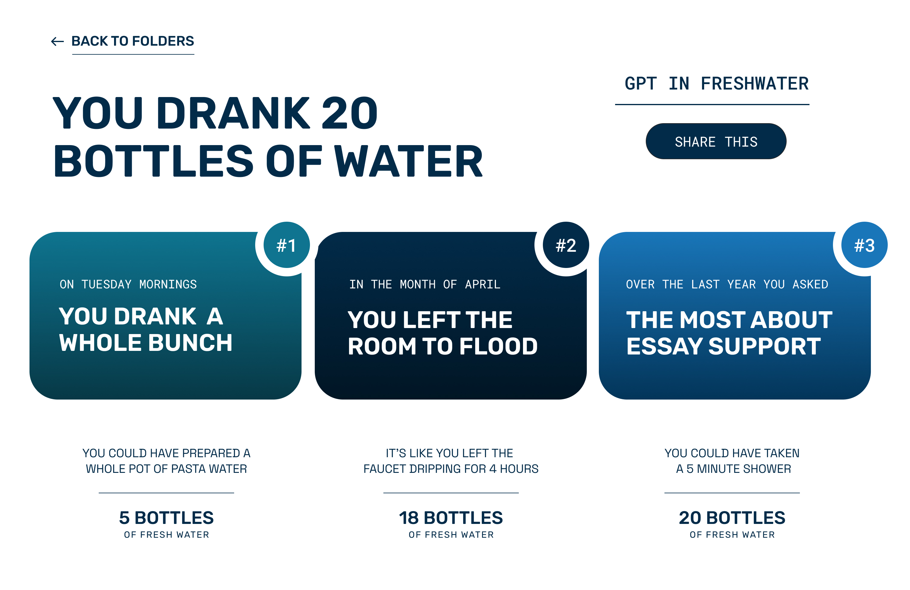
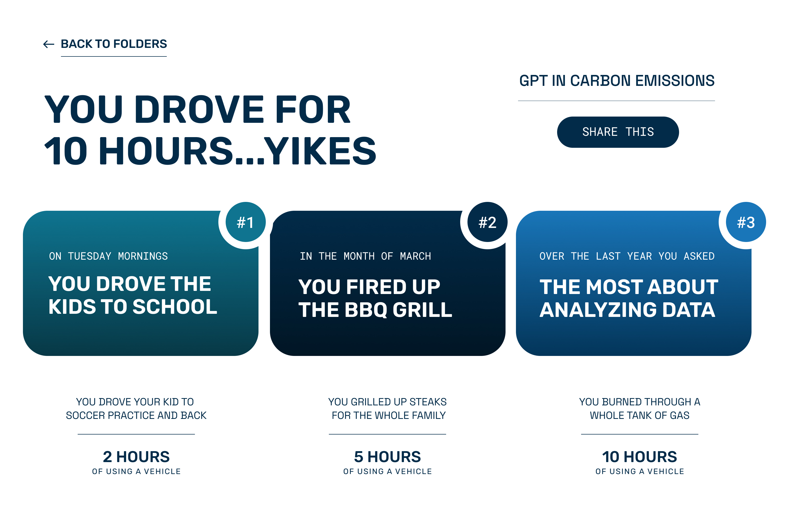

# Chat Wrapped

**Chat Wrapped** is a joint project between **UCLA Design Media Arts** and **San Francisco State University Computer Science**.  
Inspired by *Spotify Wrapped*, this collaboration blends design and engineering to reveal the real **environmental impact** of your ChatGPT usage.

Upload your ChatGPT data → receive a personalized breakdown of **water usage**, **CO₂ emissions**, and **electricity consumption** generated by your top chat prompts.

ChatGPT is part of our everyday workflow — yet its environmental footprint is largely invisible.  
Chat Wrapped makes those costs *personal* and *visible*.  

We analyze your exported ChatGPT messages and estimate environmental metrics based on:

- model used  
- size of each message  
- conversation length  

  

# User Flow

  

---

## How It Works

  

---

## Individual Pages

### Electric

  

### Water

  

### CO2

  

### Load Page

  

